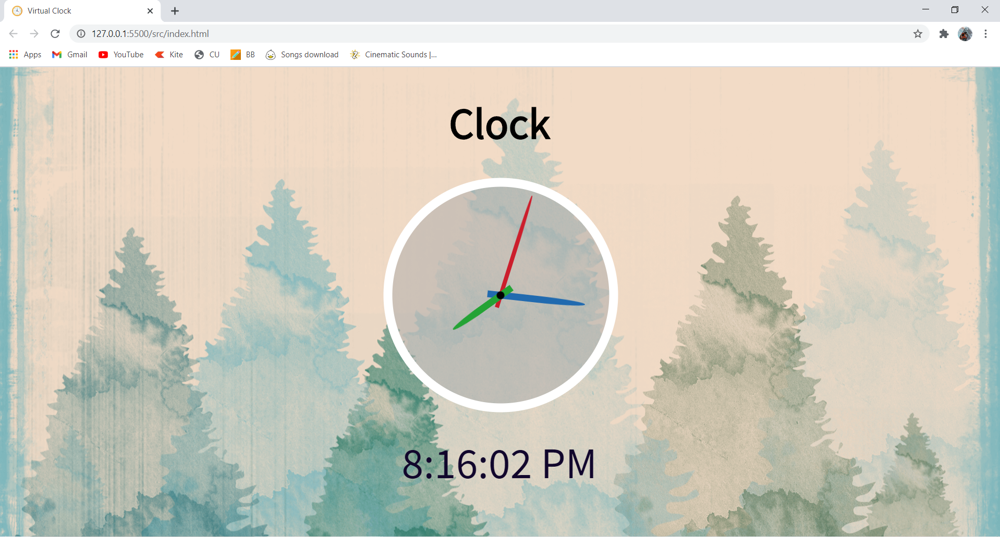

<div align="center">

<h1>Virtual Clock</h1>

<p>
  <strong>A website where the you can see a clock running at the current time.</strong>
  <br /><br />
  Build from scratch with no dependency.
</p>

<p>
  <sub>Made with ❤︎ by
    <a href="https://github.com/wandering-sage">Shivam Kumar</a>
  </sub>
</p>
</div>

## Getting Started
- Clone this repo and unzip the folder wherever you want.
- Launch your **Terminal** or **Command prompt**
- Change directory to where you unzipped this folder.
```bash
cd Desktop
cd virtual-clock-main
```
- Type npm start to run the program.
```bash
npm start
```
- The website will be running at [http://127.0.0.1:3000/](http://127.0.0.1:3000/)
- Enjoy!

## Project in Action




